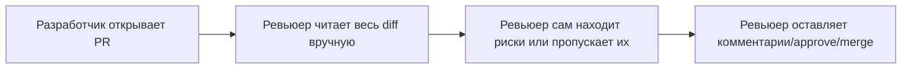
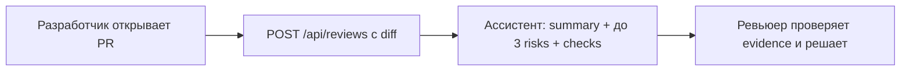

# Анализ процесса: AS IS и TO BE

Файл ведёт OpenCode. Обсудите с агентом содержание и проверьте предложенный diff. Все дополнения и исправления поручайте агенту в чате.

## AS IS

Разработчик открывает PR в GitHub → человек-ревьюер получает уведомление → ревьюер вручную читает весь diff целиком, без приоритизации по риску → ревьюер сам решает, есть ли проблема, и оставляет комментарии или approve/merge.

Участники: разработчик (автор PR), человек-ревьюер.

Задержки и ручные операции:
- ревьюер тратит время на чтение всего diff, включая безрисковые изменения (например, форматирование);
- нет автоматической проверки на типовые риски (секреты в diff, отсутствие обработки ошибок, отсутствие валидации входных данных) — всё зависит от внимательности и опыта конкретного ревьюера;
- при большом diff или высокой загрузке ревьюер может пропустить PR в очереди или отложить ревью.

Точки потери информации: если ревьюер не заметил риск (например, секрет в diff или отсутствие timeout на внешний вызов), это не фиксируется нигде и уходит в prod без следа.

## TO BE

Разработчик открывает PR → PR-diff отправляется в `POST /api/reviews` (реализация — [`TRAINING_PR.diff`](TRAINING_PR.diff)) → ассистент возвращает `summary`, до трёх `risks` с `file`/`line`/`evidence` и список `checks` → человек-ревьюер читает готовый список рисков вместо всего diff, сверяет evidence по указанным строкам и сам принимает решение (approve/merge/правки) — ассистент решения не принимает (`SCOPE-1` в [`README.md`, «Учебный кейс»](README.md#учебный-кейс-ai-помощник-ревьюера-pr)).

## Разница

| Что меняется | AS IS | TO BE | Как проверим изменение |
|---|---|---|---|
| Кто ищет риски в diff | Только человек-ревьюер, вручную, по всему diff | Ассистент предварительно выделяет до 3 рисков с evidence, ревьюер проверяет их и решает сам | Сравнение времени и полноты ревью на baseline (`P1-01`) vs с master prompt (`P1-02`) в [`prompts.md`](prompts.md) |
| Приоритизация рисков | Нет — ревьюер сам решает, что важно | Явный лимит ≤3 риска, отсортированных по обоснованности (`OUT-1`) | Проверка структуры ответа ассистента на соответствие `OUT-1` |
| Проверяемость риска | Зависит от памяти/заметок ревьюера, не формализована | Каждый риск обязан иметь `file`, `line`, `evidence` (`QA-1`) | Ручная сверка evidence с diff |
| Решение по PR | Принимает ревьюер | Принимает ревьюер (ассистент не может approve/merge — `SCOPE-1`) | Не меняется — фиксируем, что это ограничение сохранено |

## Как использовали AI

- Для чего: сравнить процесс ревью без ассистента (AS IS) и с ассистентом на основе `TRAINING_PR.diff` (TO BE), чтобы явно увидеть, что меняется для ревьюера.
- Тип промпта: не использовал AI для этого раздела — описал процесс вручную на основе задачи из [`README.md`, «Учебный кейс»](README.md#учебный-кейс-ai-помощник-ревьюера-pr) и структуры `TRAINING_PR.diff`.
- Строка в [`prompts.md`](prompts.md): —
- Что проверили и исправили сами: убедился, что TO BE не нарушает `SCOPE-1` (ассистент не принимает решения) и что diff используется как пример реализации инкремента, а не как источник процесса.
