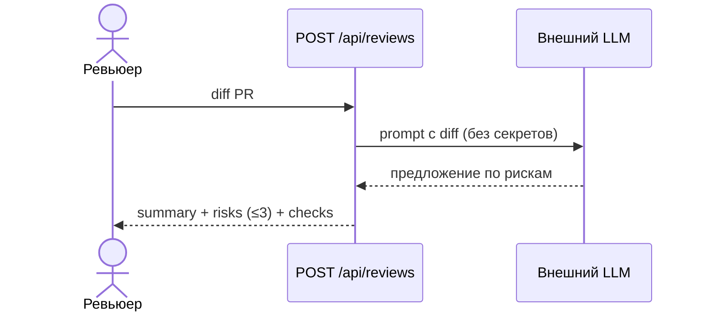

# Use cases и user stories

Файл ведёт OpenCode. Обсудите с агентом содержание и проверьте предложенный diff. Все дополнения и исправления поручайте агенту в чате.

## Первый рабочий сценарий

**Когда** ревьюер отправляет diff PR в `POST /api/reviews`, **система** возвращает краткое summary изменения, не больше трёх обоснованных рисков (с файлом, строкой и evidence) и список проверок, **а пользователь получает** сжатый, проверяемый список того, на что обратить внимание, не читая весь diff вручную.

Не входит в этот сценарий:

- approve, merge или любое изменение кода со стороны ассистента (`SCOPE-1`);
- анализ нескольких PR одновременно или истории изменений — только один diff за раз;
- автоматическая публикация комментария в GitHub — ответ идёт человеку, который сам решает, что делать дальше.

## Use case

| Поле | Значение |
|---|---|
| Актор | Человек-ревьюер |
| Триггер | Ревьюер отправляет diff PR в `POST /api/reviews` |
| Предусловия | Diff короче 20 000 символов (`API-1`); в diff уже нет открытых секретов, либо они будут удалены перед отправкой во внешний LLM (`SEC-1`) |
| Основной результат | Ответ с `summary`, ≤3 `risks` (`file`, `line`, `evidence`, `risk`) и `checks` (`OUT-1`); ревьюер сверяет evidence по diff и сам решает |
| Ошибка или отказ | Diff длиннее лимита → отказ (`API-1`); LLM не отвечает за 10 секунд → контролируемый отказ вместо зависания (`REL-1`); ни один риск не подтверждён — возвращается пустой `risks: []`, а не выдуманный риск (`QA-1`) |



## User stories и acceptance criteria

```gherkin
Feature: Ассистент код-ревью PR

  Scenario: Позитивный
    Given ревьюер отправил diff короче 20 000 символов в POST /api/reviews
    When ассистент проанализировал diff и нашёл риски, подтверждённые строками diff
    Then ответ содержит summary, не больше трёх risks с file/line/evidence и список checks

  Scenario: Негативный или граничный
    Given ревьюер отправил diff длиннее 20 000 символов
    When система получает запрос
    Then возвращается отказ с HTTP 413 без обращения к LLM
```

## Как использовали AI

- Для чего: не использовал AI для этого раздела — use case и user story собраны вручную из задачи помощника ([`README.md`](README.md#задача-помощника)) и правил `context.md`, чтобы не смешивать факты кейса с догадками модели.
- Тип промпта: —
- Строка в [`prompts.md`](prompts.md): —
- Что проверили и исправили сами: проверил, что сценарий не нарушает `SCOPE-1` (ассистент не принимает решения) и что негативный сценарий соответствует `API-1`.
