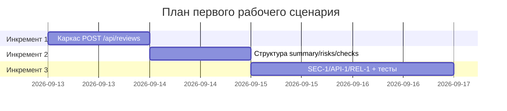

# План поставки

Файл ведёт OpenCode. Обсудите с агентом содержание и проверьте предложенный diff. Все дополнения и исправления поручайте агенту в чате.

## Инкременты и ответственность

| Инкремент | Наблюдаемый результат | Что делает человек | Что делает AI или субагент | Проверка | Зависимости |
|---|---|---|---|---|---|
| 1 | Эндпоинт `POST /api/reviews` возвращает произвольный `{"comment": answer}` от LLM (реализация — [`TRAINING_PR.diff`](TRAINING_PR.diff)) | Разработчик пишет каркас роута и сервиса, отправляет тестовый diff вручную | AI-агент (OpenCode) генерирует код `ReviewService`/`api.py` по промпту разработчика | Ручной прогон с `TRAINING_PR.diff`, чтение ответа | Нет |
| 2 | Ответ приведён к структуре `summary`/`risks`(≤3)/`checks` (`OUT-1`), риск требует `file`/`line`/`evidence` (`QA-1`) | Разработчик формулирует Context Pack и master prompt с правилами `OUT-1`/`QA-1` | AI-агент дописывает парсинг/валидацию ответа LLM под структуру | Сравнение ответа P1-01 (zero-shot) vs P1-02 (master prompt) в `prompts.md` по чек-листу «Сравнение двух запусков» | Инкремент 1 |
| 3 | Добавлены `SEC-1` (удаление секретов), `API-1` (лимит 20 000 символов), `REL-1` (timeout 10с) | Разработчик пишет тесты на каждое правило (secrets в diff, длинный diff, таймаут LLM) | AI-агент предлагает реализацию редактора секретов и обработку timeout/ошибок | `tests_unit.md`/`tests_integration.md`: кейсы на diff с токеном, на diff >20000 символов, на зависший LLM-вызов | Инкремент 2 |

## Диаграмма Ганта

## Как использовали AI

- Для чего: не использовал AI для плана поставки — инкременты выстроены вручную от простого каркаса (как в `TRAINING_PR.diff`) к соответствию всем правилам Context Pack.
- Тип промпта: —
- Строка в [`prompts.md`](prompts.md): —
- Что проверили и исправили сами: проверил, что каждый инкремент опирается на предыдущий и что все правила `SEC-1`/`API-1`/`REL-1`/`OUT-1`/`QA-1` из `context.md` покрыты хотя бы одним инкрементом.
